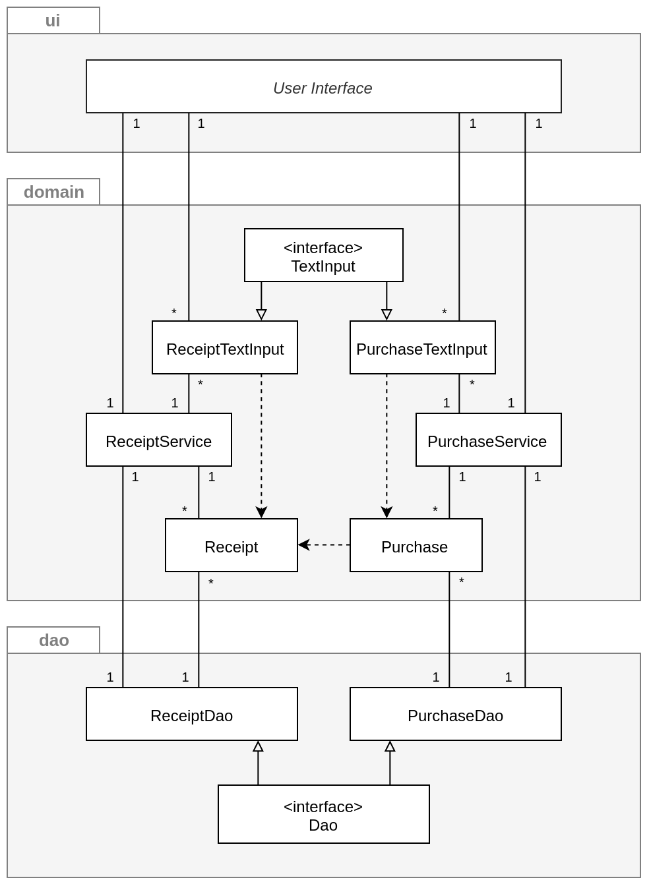
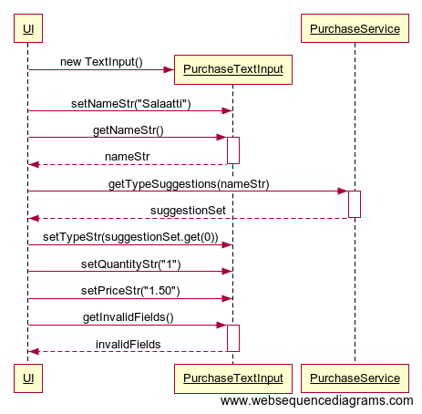
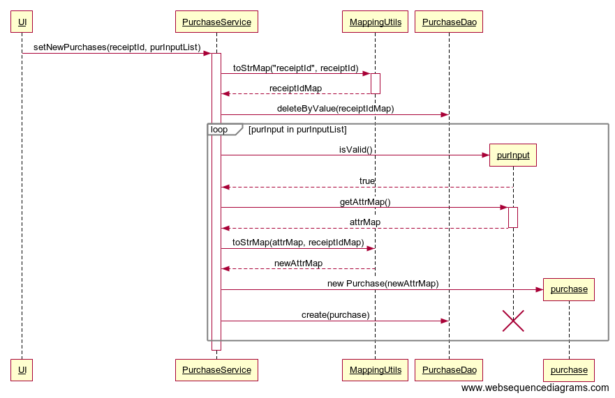

# Arkkitehtuurikuvaus

## Rakenne

Ohjelman rakenne noudattaa kolmitasoista kerrosarkkitehtuuria. Koodin pakkausrakenne on seuraava:

Pakkaus _frt.ui_ sisältää JavaFX -käyttöliittymän, _frt.domain_ sisältää sovelluslogiikan ja _frt.dao_ tietojen pysyväistallennuksesta vastaavan koodin. Pakkaus _frt.utilities_ sisältää koko sovelluksen laajuisesti käytettäviä apuluokkia.   

## Pääluokka
MainApp-luokka on sovelluksen käynnistysluokka (_jar-tiedostosta käynnistäessä käytetään Launcher-luokkaa, joka kutsuu metodia MainApp.main_). MainApp rakentaa käyttöliittymän ja luo tarvittavat Service- ja DAO-luokat, sekä tekee riippuvuusinjektiot.

### Utilities
Pakkaus _utilities_ sisältää erinäisiä apuluokkia, joita hyödynnetään sovelluksen laajuisesti.

CurrencyUtils- ja DateUtils-luokat sisältävät päivämäärien ja valuuttojen muotoiluun ja validointiin käytettäviä vakioita.

MappingUtils-luokka sisältää apumetodeja, joita käytetään apuna kun datamalleja muunnetaan toisiksi datamalleiksi. Joissain testeissä hyödynnetään myös luokan reflektiivisiä apumetodeja. Luokka sisältää myös apumetodeja merkkijonojen muuntamiseksi.   

## Käyttöliittymä

Käyttöliittymä sisältää yhden näkymän, jonka avulla kuittitietoja hallinnoidaan. 

Käyttöliittymän asettelu ja kieli on määritelty erillisessä _resources_ hakemistossa sijaitsevassa fxml-tiedostossa. Kyseistä tiedostoa muokkaamalla on mahdollista muuttaa käyttöliittymän kieltä. Tällöin pakkauksen _utilities_ sisältämät päivämäärien ja valuuttojen muotoilusta ja validoinnista vastaavat vakiot voisi olla tarpeellista muuttaa.

Hakemisto _resources_ sisältää myös css-tyylitiedoston, jossa on määritelty käyttöliittymän JavaFX-tyylit.

_FXMLController_ -luokka vastaa käyttöliittymän kontrollilogiikasta. Käynnistysluokka _MainApp_ luo kontrolleri-instanssin ja kutsuu sen _init_ -metodia. Kontrolleriluokalla on attribuutteina kuitti- ja ostoslistat, jotka injektoidaan set-metodilla ReceiptService- ja PurchaseService -luokkien olioihin. Kontrolleriluokka ainoastaan lukee näitä listoja tai kuuntelee niissä tapahtuvia muutoksia. Service-luokat vastaavat varsinaisesta kuittien ja ostosten käsittelystä kontrollerista tulevien kutsujen mukaisesti. 

Kontrolleri käsittelee pääasiassa TextInput-rajapinnan toteuttavia syötetieto-olioita, joihin se tallentaa käyttäjän tekstikenttiin syöttämiä tietoja. TextInput-rajapinta määrittelee yksinkertaiset metodit tietojen validointiin. Kontrolleri kutsuu syötetieto-olioiden _getInvalidFields_-metodia validoidakseen syötteet. Varsinaisesta validoinnista vastaa kuitenkin TextInput-olio. Kontrolleri antaa syötetiedot Service-olioille kutsujen argumentteina.

## Sovelluslogiikka

Sovelluksen loogisen mallin muodostavat Receipt- ja Purchase-luokat, jotka kuvaavat kuttia ja niihin liittyviä ostoksia. Purchase-luokan toteutus on osin riippuvainen Receipt-luokasta.

TextInput-rajapinnan oliot vastaavat syötteiden validoinnissa käytetystä logiikasta sekä tekstisyötteiden parsimisesta. Näiden luokkien toteutus on täysin riippuvainen niitä vastaavista datamalleista.

Service-luokan oliot vastaavat varsinaisesta sovelluslogiikasta ja toiminnallisista kokonaisuuksista. Service-luokan oliot saavat konstruktorin parametrina DAO-oliot. Service-luokat tuntevat TextInput-luokat vain rajapinnan kautta.

Ohjelman luokkien suhdetta kuvaava luokka/pakkauskaavio:

## Tietojen pysyväistallennus

Pakkauksen _dao_ -luokat huolehtivat tietojen pysyväistallennuksesta. Ne noudattavat Data Access Object -suunnittelumallia. Service-luokat tuntevat vain DAO-rajapinnan. Testuksessa nille annetaan keskusmuistiin tallennettuja toteutuksia.

Kuittitiedot tallennetaan H2-tietokantaan. Varsinaisten DAO-luokkien testauksessa käytetään hyväksi keskusmuistiin väliaikaisesti luotavaa H2-tietokantaa.

Hakemistossa _/src/main/java/resources_ sijaitsevassa _application.properties_ -tiedostossa on määritelty H2-tietokannan sijainti ja nimi, sekä käyttäjätunnus ja salasana. Saman hakemiston _schema.sql_ -tiedostossa on määritelty tietokannan taulujen luomiseen käytettävät SQL-lauseet, ja _data.sql_ -tiedostossa on määriteltynä tietokantaan oletuksena syötettävät tiedot.

Daojen tehtävä sovelluksessa on vastata vain tiedon pysyväistallennuksesta. Service-luokan oliot pitävät keskusmuistissa tietoa kuiteista ja ostoksista suorituksen aikana. Ohjelman käynnistyessä ne pyytävät DAO-olioiltaan listaa kaikista kuiteista ja ostoksista. Ohjelman suorituksen aikana Service-oliot voivat pyytää DAO-olioita tallentamaan muuttuneita tietoja tietokantaan.

Kuittien kuvat tallennetaan tietokantaan muiden kuittitietojen yhteyteen.

## Uuden kuitin lisääminen vaiheittain
Seuraavaksi käydään läpi uuden kuitin lisääminen järjestelmään, mikä antaa hyvän käsityksen sovelluksen luokkien toiminnasta.

Uuden kuitin luominen alkaa, kun käyttäjä on syöttänyt kuitin tiedot tekstikenttiin ja pyytänyt tietojen tallentamista. Ensin käyttöliittymä luo TextInput-olion, johon se asettaa tekstikenttien tiedot. Tämän jälkeen se pyytää epäkelpoja kenttiä syöteoliolta. Jos epäkelpoja kenttiä on, niin käyttöliittymä osoittaa sen käyttäjälle.

Käyttäjä voi valita tiedostojärjestelmästä kuitille kuvan. Käyttöliittymä lähettää kuvan polun ReceiptService -oliolle, joka lataa kuvan keskusmuistiin ja esikäsittelee sen, ja palauttaa sen jälkeen esikäsittelyn kuvan käyttöliittymälle. Käyttöliittymä näyttää kuvan käyttäjälle. Jos kaikki syötteet ovat kelvollisia, niin käyttöliittymä kutsuu ReceiptService -olion newReceipt()-metodia, jolle se antaa argumenteiksi syöteolion ja esikäsitellyn kuvan.

ReceiptService luottaa, että syötetekstit on validoitu käyttöliittymässä ja kutsuu parametrina saamansa syöteolion getAttrMap()-metodia, joka palauttaa kuitin tiedot parsittuina Map-oliossa. Tämän jälkeen ReceiptService luo uuden Receipt -olion, joka saa konstruktorin parametrina Map-olion, jonka avulla se asettaa omat attribuuttinsa. ReceiptService asettaa kuittiin myös kuvan. Tämän jälkeen se lähettää kuitin daolle, joka tallentaa kuitin tiedot tietokantaan ja palauttaa sieltä kuitille id-tunnisteen. ReceiptService asettaa vielä tämän tunnisteen kuitille ennen kuin se palauttaa uuden kuitin käyttöliittymälle. Lopuksi käyttöliittymä pyytää kuitin id-tunnistetta ostosten käsittelyä varten.

Seuraavaksi prosessi jatkuu ostosten tallentamisella. Nyt käyttäjä syöttää ostoksen listaan:

Käyttöliittymä pyytää tyyppiehdotuksia ostoksen nimestä, ja PurchaseService-luokka palauttaa ehdotuksia sisältävän setin. Tässä esimerkissä käyttäjä valitsee ensimmäisen ehdotuksen ostoksen tyypiksi, jolloin käyttöliittymä asettaa sen ostoksen tyypiksi. Ostokset myös validoidaan lopuksi ja epäkelvot syötteet osoitetaan käyttäjälle.

Kun kaikki ostokset on syötetty, niin käyttäjä pyytää jälleen kuitin tallentamista, jolloin ostosten tallentaminen etenee seuraavasti:

Käyttöliittymä kutsuu PurchaseService-luokan metodia _setNewPurchases_, jolle se antaa argumentteina aiemmin tietokantaan luodun kuitin id-tunnisteen sekä TextInput-olioiden listan, joka kuvastaa kuittiin liittyviä ostoksia.

PurchaseService luo ensimmäiseksi MappingUtils-luokan avulla Map-olion, joka kuvastaa kuitin id-tunnistetta. Tämän jälkeen se kutsuu PurchaseDao-luokan _deleteByValue_-metodia, jolle se antaa Map-olion argumenttina. PurchaseDao poistaa tietokannasta kaikki kuitin id-tunnisteeseen liittyvät ostokset, jos sellaisia on.

Seuraavaksi PurchaseService käy läpi kaikki TextInput-oliot listalta. Ensimmäiseksi se tarkistaa onko syöte validi. Syötteen ollessa validi, se pyytää syöteolion attribuutit Map-oliona. Tämän jälkeen se käyttää _MappingUtils.toStrMap_-metodia yhdistääkseen attribuutit sisältävään Map-olioon kuitin id:n sisältävän Map-olion. Sitten se antaa lopullisen Map-olion Purchase-luokan konstruktorille, joka luo mapin mukaisen ostos-olion. Lopuksi PurchaseService pyytää daoa luomaan tietokantaan uuden ostoksen.

## Heikkoudet rakenteessa
PurchaseService -luokka tarvitsee konfiguraatiotiedostossa olevat ostostyyppimäärittelyt. Tällä hetkellä konfiguraatiotiedostoa käsitellään kyseisessä luokassa. Konfiguraatiotiedoston käsittely voisi tapahtua omassa luokassaan tai lukemisen voisi hoitaa kokonaan Springin avulla. Kuvadatan käsittely tapahtuu tällä hetkellä ReceiptService-luokassa, mutta kuva-toimintojen lisääntyessä tulisi kuvadatan käsittelyn tapahtua myös omassa luokassaan.
