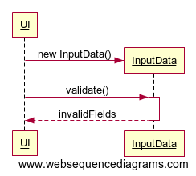

# Arkkitehtuurikuvaus

## Rakenne

Ohjelman rakenne noudattaa kolmitasoista kerrosarkkitehtuuria. Koodin pakkausrakenne on seuraava:

Pakkaus _frt.ui_ sisältää JavaFX -käyttöliittymän, _frt.domain_ sisältää sovelluslogiikan ja _frt.dao_ tietojen pysyväistallennuksesta vastaavan koodin. Pakkaus _frt.utilities_ sisältää koko sovelluksen laajuisesti käytettäviä apuluokkia.   

## Käyttöliittymä

Käyttöliittymä sisältää yhden näkymän, jonka avulla kuittitietoja hallinnoidaan. 

Käyttöliittymän asettelu ja kieli on määritelty erillisessä fxml-tiedostossa. Kyseistä tiedostoa muokkaamalla on mahdollista muuttaa käyttöliittymän kieltä. Tällöin pakkauksen _utilities_ sisältämät päivämäärien ja valuuttojen muotoilusta ja validoinnista vastaavat vakiot voisi olla tarpeellista muuttaa. Tarkistuksen ja muotoilun määrittelevät merkkijonot voisi myös siirtää osaksi fxml-tiedostoa.

_FXMLController_ -luokka vastaa käyttöliittymän kontrollilogiikasta. Käynnistysluokka _MainApp_ luo kontrolleri-instanssin ja kutsuu sen _init()_ -metodia. Kontrolleriluokalla on attribuutteina kuitti- ja ostoslistat, jotka injektoidaan _init()_-metodin luomiin ReceiptService- ja PurchaseService -luokkien olioihin. Kontrolleriluokka ainoastaan lukee näitä listoja tai kuuntelee niissä tapahtuvia muutoksia. Service-luokat vastaavat varsinaisesta kuittien ja ostosten käsittelystä kontrollerista tulevien kutsujen mukaisesti. 

Kontrolleri käsittelee pääasiassa InputData-rajapinnan toteuttavia syötetieto-olioita, joihin se tallentaa käyttäjän tekstikenttiin syöttämiä tietoja. InputData-rajapinta määrittelee yksinkertaiset metodit tietojen validointiin. Kontrolleri kutsuu syötetieto-olioiden _getInvalidFields()_-metodia validoidakseen syötteet. Varsinaisesta validoinnista vastaa kuitenkin InputData-olio. Kontrolleri antaa syötetiedot Service-olioille kutsujen parametrina.

## Sovelluslogiikka

## Tietojen pysyväistallennus

Pakkauksen _dao_ -luokat huolehtivat tietojen pysyväistallennuksesta. Ne noudattavat Data Access Object -suunnittelumallia. Service-luokat tuntevat vain Dao-rajapinnan. Testuksessa luokille annetaan keskusmuistiin tallennettuja toteutuksia.

Kuittitiedot tallennetaan H2-tietokantaan. Varsinaisten Dao-luokkien testauksessa käytetään hyväksi keskusmuistiin väliaikaisesti luotavaa H2-tietokantaa.

Hakemistossa _/src/main/java/resources_ sijaitsevassa _application.properties_ -tidostossa on määritelty H2-tietokannan sijainti ja nimi, sekä käyttäjätunnus ja salasana. Saman hakemiston _schema.sql_ -tiedostossa on määritelty tietokannan taulujen luomiseen käytettävän SQL-lauseet, ja _data.sql_ -tiedostossa on määriteltynä tietokantaan oletuksena syötettävät tiedot. Kummankin tiedoston sisältämät SQL-kyselyt tehdään joka kerta, kun sovellus käynnistetään.  

