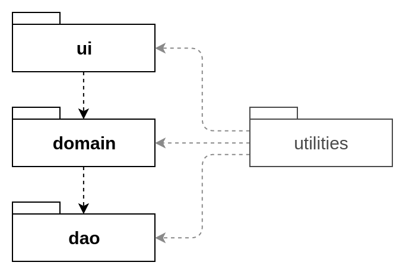

# Arkkitehtuurikuvaus

## Rakenne

Ohjelman rakenne noudattaa kolmitasoista kerrosarkkitehtuuria. Koodin pakkausrakenne on seuraava:

Pakkaus _frt.ui_ sisältää JavaFX -käyttöliittymän, _frt.domain_ sisältää sovelluslogiikan ja _frt.dao_ tietojen pysyväistallennuksesta vastaavan koodin. Pakkaus _frt.utilities_ sisältää koko sovelluksen laajuisesti käytettäviä apuluokkia.   

## Käyttöliittymä

Käyttöliittymä sisältää yhden näkymän, jonka avulla kuittitietoja hallinnoidaan. 

Käyttöliittymän asettelu ja kieli on määritelty erillisessä _resources_ hakemistossa sijaitsevassa fxml-tiedostossa. Kyseistä tiedostoa muokkaamalla on mahdollista muuttaa käyttöliittymän kieltä. Tällöin pakkauksen _utilities_ sisältämät päivämäärien ja valuuttojen muotoilusta ja validoinnista vastaavat vakiot voisi olla tarpeellista muuttaa. Tarkistuksen ja muotoilun määrittelevät merkkijonot voisi myös siirtää osaksi fxml-tiedostoa.

Hakemisto _resources_ sisältää myös css-tyylitiedoston, jossa on määritelty käyttöliittymän javaFX-tyylit.

_FXMLController_ -luokka vastaa käyttöliittymän kontrollilogiikasta. Käynnistysluokka _MainApp_ luo kontrolleri-instanssin ja kutsuu sen _init()_ -metodia. Kontrolleriluokalla on attribuutteina kuitti- ja ostoslistat, jotka injektoidaan _init()_-metodin luomiin ReceiptService- ja PurchaseService -luokkien olioihin. Kontrolleriluokka ainoastaan lukee näitä listoja tai kuuntelee niissä tapahtuvia muutoksia. Service-luokat vastaavat varsinaisesta kuittien ja ostosten käsittelystä kontrollerista tulevien kutsujen mukaisesti. 

Kontrolleri käsittelee pääasiassa InputText-rajapinnan toteuttavia syötetieto-olioita, joihin se tallentaa käyttäjän tekstikenttiin syöttämiä tietoja. InputText-rajapinta määrittelee yksinkertaiset metodit tietojen validointiin. Kontrolleri kutsuu syötetieto-olioiden _getInvalidFields()_-metodia validoidakseen syötteet. Varsinaisesta validoinnista vastaa kuitenkin InputText-olio. Kontrolleri antaa syötetiedot Service-olioille kutsujen argumentteina.

## Sovelluslogiikka

Sovelluksen loogisen mallin muodostavat Receipt- ja Purchase-luokat, jotka kuvaavat kuttia ja niihin liittyviä ostoksia.

TextInput-rajapinnan oliot vastaavat syötteiden validoinnissa käytetystä logiikasta sekä tekstisyötteiden parsimisesta. Service-luokan oliot vastaavat varsinaisesta sovelluslogiikasta ja toiminnallisista kokonaisuuksista. Service-luokan oliot saavat konstruktorin parametrina Dao-oliot.

Ohjelman luokkien suhdetta kuvaava luokkakaavio:

## Tietojen pysyväistallennus

Pakkauksen _dao_ -luokat huolehtivat tietojen pysyväistallennuksesta. Ne noudattavat Data Access Object -suunnittelumallia. Service-luokat tuntevat vain Dao-rajapinnan. Testuksessa nille annetaan keskusmuistiin tallennettuja toteutuksia.

Kuittitiedot tallennetaan H2-tietokantaan. Varsinaisten Dao-luokkien testauksessa käytetään hyväksi keskusmuistiin väliaikaisesti luotavaa H2-tietokantaa.

Hakemistossa _/src/main/java/resources_ sijaitsevassa _application.properties_ -tidostossa on määritelty H2-tietokannan sijainti ja nimi, sekä käyttäjätunnus ja salasana. Saman hakemiston _schema.sql_ -tiedostossa on määritelty tietokannan taulujen luomiseen käytettävät SQL-lauseet, ja _data.sql_ -tiedostossa on määriteltynä tietokantaan oletuksena syötettävät tiedot. Kummankin tiedoston sisältämät SQL-kyselyt tehdään joka kerta, kun sovellus käynnistetään.

Daojen tehtävä sovelluksessa on vastata vain tiedon pysyväistallennuksesta. Service-luokan oliot pitävät keskusmuistissa tietoa kuiteista ja ostoksista suorituksen aikana. Ohjelman käynnistyessä ne pyytävät Dao-olioiltaan listaa kaikista kuiteista ja ostoksista. Ohjelman suorituksen aikana Service-oliot voivat pyytää Dao-olioita tallentamaan muuttuneita tietoja tietokantaan.

## Päätoiminnallisuudet

Uuden kuitin lisääminen järjestelmään:

Uuden kuitin luominen alkaa, kun käyttäjä on syöttänyt kuitin tiedot tekstikenttiin ja pyytänyt tietojen tallentamista. Ensin käyttöliittymä luo InputText-olion, johon se asettaa tekstikenttien tiedot. Tämän jälkeen se pyytää epäkelpoja kenttiä syöteoliolta. Jos epäkelpoja kenttiä on, niin käyttöliittymä osoittaa sen käyttäjälle.

Käyttäjä voi valita tiedostojärjestelmästä kuitille kuvan. Käyttöliittymä lähettää kuvan polun ReceiptService -oliolle, joka lataa kuvan keskusmuistiin ja esikäsittelee sen, ja palauttaa sen jälkeen esikäsittelyn kuvan käyttöliittymälle. Käyttöliittymä näyttää kuvan käyttäjälle. Jos kaikki syötteet ovat kelvollisia, niin käyttöliittymä kutsuu ReceiptService -olion newReceipt()-metodia, jolle se antaa argumenteiksi syöteolion ja esikäsitellyn kuvan.

ReceiptService luottaa, että syötetekstit on validoitu käyttöliittymässä ja kutsuu parametrina saamansa syöteolion getAttrMap()-metodia, joka palauttaa kuitin tiedot parsittuina Map-oliossa. Tämän jälkeen ReceiptService luo uuden Receipt -olion, joka saa konstruktorin parametrina Map-olion, jonka avulla se asettaa omat attribuuttinsa. ReceiptService asettaa kuittiin myös kuvan. Tämän jälkeen se lähettää kuitin Daolle, joka tallentaa kuitin tiedot tietokantaan ja palauttaa sieltä kuitille id-tunnisteen. ReceiptService asettaa vielä tämän tunnisteen kuitille ennen kuin se palauttaa uuden kuitin käyttöliittymälle.

Kuittien kuvat tallennetaan tietokantaan muiden kuittitietojen yhteyteen.

