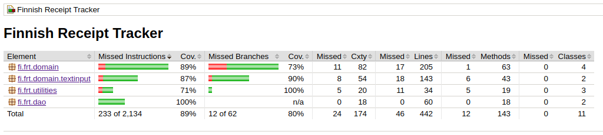

# Testausdokumentti
Ohjelmaa on testattu automatisoiduin yksikkö- ja integraatiotestein JUnitilla, sekä manuaalisesti tapahtunein järjestelmätason testein.

## Yksikkötestaus
Sovelluksen luokkia on testattu kattavasti yksikkötestein. Tällä hetkellä pelkästään yksikkötestien läpimeno antaa hyvän ennusteen ohjelman virheettömästä toiminnasta.

### Sovelluslogiikka
Pakkauksen _domain_ kaikille luokille, lukuunottamatta Receipt- ja Purchase-luokkaa, on luotu automaattiset yksikkötestit, jotka testaavat, että luokat toimivat odotetusti. Receipt- ja Purchase-luokat sisältävät käytännössä vain gettereitä ja settereitä, joten luokkien erilliselle testaamiselle ei ole tarvetta.

#### TextInput -luokat
Yksikkötestit tarkistavat, että luokkien suorittama syötteiden validointi toimii odotetusti.

#### Service -luokat
Yksikkötestit tarkistavat Service-luokkien julkisten metodien toiminnan. Testitapaukset simuloivat käyttöliittymän luokkiin tekemiä kutsuja. Testeissä käytetään hyväksi Dao- ja TextInput-valeluokkia. Valeluokkien avulla tarkistetaan, että Service-luokat toimivat odotetusti rajapintojen kanssa.

### DAO-luokat
DAO-luokkia testataan käyttämällä keskusmuistiin väliaikaisesti luotavaa H2-tietokantaa.

## Integraatiotestaus
Integraatiotestissä tarkistetaan, että luokat toimivat kokonaisuutena oikein. Testeissä hyödynnetään keskusmuistitietokantaa.

## Testauskattavuus
Käyttöliittymää lukuunottamatta testauksen rivikattavuus on 89% ja haarautumakattavuus 80%.

 

## Järjestelmätestaus
Järjestelmätestaus on suoritettu manuaalisesti.

### Asennus ja konfigurointi
Sovellus on haettu ja sitä on testattu Linux-ympäristössä käyttöohjeessa näytetyllä konfiguraatiolla.

## Sovellukseen jääneet laatuongelmat
Konfiguraation määrittelemien tiedostojen latauksessa ja käsittelyssä tapahtuvat virheilmoitukset voisivat olla vielä yksityiskohtaisempia. Olisi myös hyvä, jos käyttöliittymästä voisi avata lokin, josta näkee konfiguraatioon liittyvät ongelmat. Tällä hetkellä ne tulostetaan standardivirtaan.