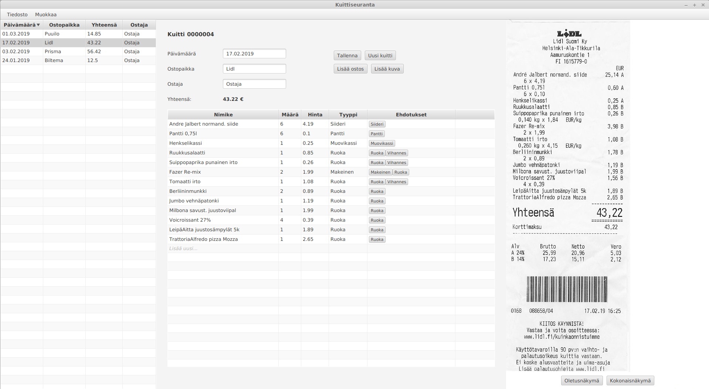

# Vaatimusmäärittely

## Sovelluksen tarkoitus

Sovellus auttaa käyttäjää seuraamaan (suomalaisia) ostokuitteja, sekä pitämään niistä kirjaa.

## Käyttäjät

Sovelluksella ei ole varsinaisia käyttäjärooleja. Kuka vain voi käyttää sovellusta ostokuittien seuraamiseen.

## Käyttöliittymä

Sovelluksessa on aluksi vain yksi näkymä, joka on jaettu kolmeen osaan.

Vasemmanpuoleisessa kuittitaulukossa on lista kaikista järjestelmään syötetyistä kuiteista.
Keskellä näkyy kuittitaulukosta kulloinkin valitun kuitin tiedot. Oikealla on kuva kuitista. 

## Perusversion tarjoama toiminnallisuus

- Käyttäjä voi lisätä järjestelmään uuden kuitin.

  - Kuitista tallennetaan ostajan nimi, ostopaikan nimi, päivämäärä, ostokset riveittäin sekä yhteissumma.
  
  - Yksi ostosrivi koostuu ostoksen nimestä, ostostyypistä, määrästä ja yksikköhinnasta.
  
- Käyttäjä voi tarkastella kaikkia järjestelmään lisättyjä kuitteja.

- Käyttäjä voi editoida järjestelmään lisättyjä kuitteja.

- Käyttäjä voi lisätä kuitin kuvan kuittitietojen yhteyteen.
  
- Käyttäjä voi poistaa järjestelmästä kuitin.

- Ostoksille annetaan ostostyyppiehdotuksia aiemmin järjestelmään syötettyjen tietojen perusteella.

- Ostoksille annetaan ostostyyppiehdotuksia käyttäjän määrittelemien avainsanalistojen perusteella.

## Jatkokehitysideoita

Järjestelmää täydennetään mahdollisuuksien mukaan esim. seuraavilla toiminnallisuuksilla

- Käyttäjä voi pyytä yksinkertaisen yhteenvedon kuittien sisältämistä ostoksista.

- Kuittiin voi tallentaa pääostostyypin lisäksi lisäostostyyppejä (esim. päätyyppi: elintarvike, lisätyyppi: hedelmä).

- Käyttäjä voi hakea ja listata ostoksia tai kuitteja niihin liittyvien tietojen perusteella.

- Avusteinen kuittien lisäys tekstintunnistusta hyödyntämällä.

  - Kuitin kuva voidaan lähettää esim. Google Cloud Visionille, jonka antamien tietojen perusteella pyritään esitäyttämään kuitin perustiedot, sekä antamaan ostosriveille tyypiehdotuksia.
  
  - Ostostyypeistä voidaan antaa ehdotuksia ostopaikan nimen perusteella (esim. jos ostopaikan nimessä esiintyy sana "apteekki" niin ehdotetaan kaikkien rivien ostotyypiksi "lääke").
  
  - Ehdotuksia voidaan antaa pyytämällä Cloud Visionilta nimikkeen tunnistamista kuvahakuun perustuen.
  
- Käyttäjä voi luoda erilaisia raportteja ostoksista. 
