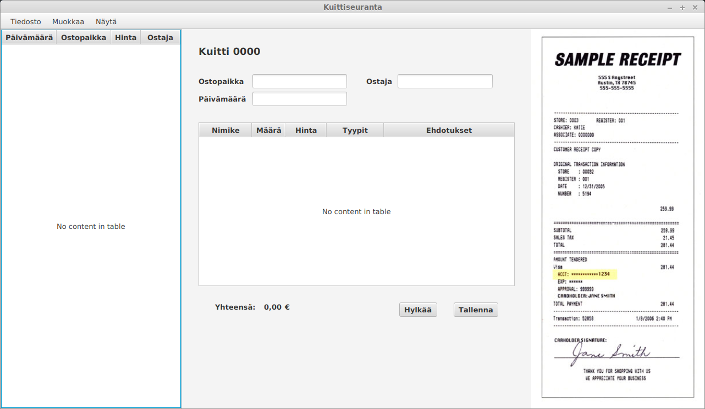

# Vaatimusmäärittely

## Sovelluksen tarkoitus

Sovellus auttaa käyttäjää seuraamaan (suomalaisia) ostokuitteja, sekä pitämään niistä kirjaa.

## Käyttäjät

Sovelluksella on yksi käyttäjärooli eli _normaali käyttäjä_.

## Käyttöliittymäluonnos

Sovelluksessa on aluksi vain yksi näkymä, joka on jaettu kolmeen osaan.

Vasemmanpuoleisessa kuittitaulukossa on lista kaikista järjestelmään syötetyistä kuiteista.
Keskellä näkyy kuittitaulukosta kulloinkin valitun kuitin tiedot. Oikealla on kuva kuitista. 

## Perusversion tarjoama toiminnallisuus

- käyttäjä voi lisätä järjestelmään uuden kuitin

  - kuitista tallennetaan ostajan nimi, ostopaikan nimi, päivämäärä, ostokset riveittäin sekä yhteissumma
  
  - yksi ostosrivi koostuu vähintään yhdestä ostostyypistä (esim. "parturi"), määrästä ja yksikköhinnasta
  
- käyttäjä voi tarkastella kaikkia järjestelmään lisättyjä kuitteja  
  
- käyttäjä voi poistaa järjestelmästä kuitin

## Jatkokehitysideoita

Järjestelmää täydennetään mahdollisuuksien mukaan esim. seuraavilla toiminnallisuuksilla

- käyttäjä voi pyytä yksinkertaisen yhteenvedon kuittien sisältämistä ostoksista

- järjestelmään jo lisättyjen kuittien tietojen editointi

- kuittiin voi tallentaa pääostostyypin lisäksi lisäostostyyppejä (esim. päätyyppi: elintarvike, lisätyyppi: hedelmä)

- käyttäjä voi hakea ja listata ostoksia tai kuitteja niihin liittyvien tietojen perusteella

- kuitin kuvan tallentaminen järjestelmään kuittitietojen yhteyteen

- avusteinen kuittien lisäys tekstintunnistusta hyödyntämällä

  - kuitin kuva voidaan lähettää esim. Google Cloud Visionille, jonka antamien tietojen perusteella pyritään esitäyttämään kuitin perustiedot, sekä antamaan ostosriveille tyypiehdotuksia
  
  - ostostyypeistä voidaan antaa ehdotuksia ostopaikan nimen perusteella (esim. jos ostopaikan nimessä esiintyy sana "apteekki" niin ehdotetaan kaikkien rivien ostotyypiksi "lääke")
  
  - jos käyttäjä on aiemmin hyväksynyt jonkin tyypin samalle nimikkeelle, niin ehdotetaan ensisijassa samaa tyyppiä uudestaan (kuittirivin nimike on siis ostopaikan käyttämä nimitys tuotteesta, esim. "Belbake puolikarkea vehnj.")
  
  - ehdotuksia voidaan antaa sanalistoja hyödyntämällä (esim. Finelin järjestelmästä lista elintarvikkeiden nimistä)
  
  - ehdotuksia voidaan antaa pyytämällä Cloud Visionilta nimikkeen tunnistamista kuvahakuun perustuen
  
- käyttäjä voi luoda erilaisia raportteja ostoksista 
